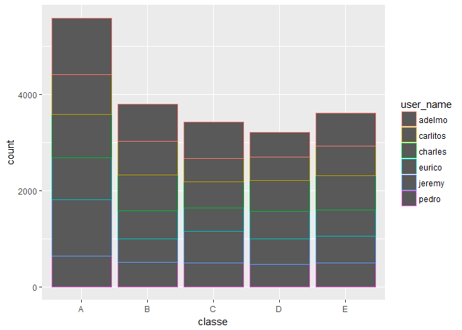
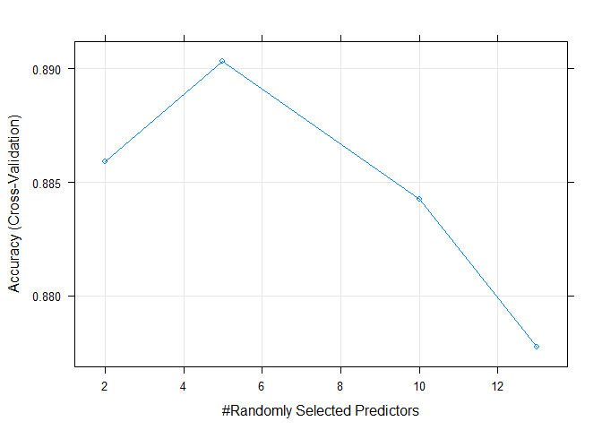

# Machine Learning Course Project
N.B. Moody  
April 7, 2017  
This report was generated under R version 3.3.3, using data from this  [link](http://groupware.les.inf.puc-rio.br/har), using the following hardware:

* Processor: Intel(R) Core(TM) i7-6500U CPU @ 2.50GHz, 2592 Mhz, 2 Cores, 4 Logical Processors
* Memory: 12gb ddr4


***

### Machine Learning - Course Project

**Project Description:** In this project, the goal will be to use data from accelerometers on the belt, forearm, arm, and dumbell of 6 participants. They were asked to perform barbell lifts correctly and incorrectly in 5 different ways. More information is available from this [website](http://groupware.les.inf.puc-rio.br/har) (see the section on the Weight Lifting Exercise Dataset). The goal of the project is to predict the manner in which they did the exercise. This is the "classe" variable in the training set.

**Criteria for the project:** You may use any of the other variables to predict with. You should create a report describing how you built your model, how you used cross validation, what you think the expected out of sample error is, and why you made the choices you did. You will also use your prediction model to predict 20 different test cases.

***

### Exploration

**Structure of the data:** The following will explore the training data, to help evaluate the type of prediction model that will handle this problem. The data consists of an Entry ID ("X"), a Participant Name ("user_name"), and a Class ("classe"), along with 157 measurement variables (listed in appendix). All users completed approximately the same number of measurements within each Class.


```
## 'data.frame':	19622 obs. of  3 variables:
##  $ X        : int  1 2 3 4 5 6 7 8 9 10 ...
##  $ user_name: Factor w/ 6 levels "adelmo","carlitos",..: 2 2 2 2 2 2 2 2 2 2 ...
##  $ classe   : Factor w/ 5 levels "A","B","C","D",..: 1 1 1 1 1 1 1 1 1 1 ...
```

```
## 
##   adelmo carlitos  charles   eurico   jeremy    pedro 
##     3892     3112     3536     3070     3402     2610
```

<!-- -->

**Preprocessing and NA Values:** This dataset contains several columns where 98% - 100% of the observations are NA. For the sake of clarity and speed of computation, I will remove these as potential predictors, in both the training and testing sets. In addition, I am removing the informational variables at the beginning of the set, since they only provide an entry-number, username, and tiemstamp information. This is the only preprocessing I will perform on the data. It leaves 60 potential predictors in the train/test sets.


```r
naCountTrain <- vector()
for(i in 1:160) {
    naSum <- sum(is.na(train[,i]))
    naCountTrain <- c(naCountTrain, naSum)
}
train <- train[,naCountTrain < 19000]
test <- test[,naCountTrain < 19000]
train <- train[,8:ncol(train)]
test <- test[,8:ncol(test)]
```

***

### Model Creation and Description

**Validation set and subsetting:** I begin my model selection process by splitting my training data into a train/validate set.

```r
set.seed(12345)
inTrain <- createDataPartition(train$classe, p=0.80, list=FALSE)
validate <- train[-inTrain,]
train <- train[inTrain,]
```

I also create some subsets of predictors, for each measurement group (dumbbell, belt, arm, forearm), to begin considering best predictors.

```r
trdumbbell <- select(train, roll_dumbbell:magnet_dumbbell_z, classe)
trbelt <- select(train, roll_belt:magnet_belt_z, classe)
trarm <- select(train, roll_dumbbell:magnet_arm_z, classe)
trforearm <- select(train, roll_forearm:magnet_forearm_z, classe)

vdumbbell <- select(validate, roll_dumbbell:magnet_dumbbell_z, classe)
vbelt <- select(validate, roll_belt:magnet_belt_z, classe)
varm <- select(validate, roll_dumbbell:magnet_arm_z, classe)
vforearm <- select(validate, roll_forearm:magnet_forearm_z, classe)
```


**Selecting and cross-valdiating a model:** After exploring several variations of logistic regression, classification tree, and random forest models (examples in appendix), the Random Forest algorithm, using the dumbbell measurements, showed the least error, acheiving an accuracy of 0.8891155.

This model, therefore, will be improved with cross-validation and used for prediction.


```r
myControl <- trainControl(method = "cv", number = 5)

bestMod <- train(classe ~ roll_dumbbell+pitch_dumbbell+yaw_dumbbell+
                     total_accel_dumbbell+gyros_dumbbell_x+
                     gyros_dumbbell_y+gyros_dumbbell_z+accel_dumbbell_x+
                     accel_dumbbell_y+accel_dumbbell_z+magnet_dumbbell_x+
                     magnet_dumbbell_y+magnet_dumbbell_z,
               data = train,
               method = "ranger",
               trControl = myControl,
               tuneGrid = data.frame(mtry = c(2,5,10,13)))

bestPredict <- predict(bestMod, validate)
bestAcc <- confusionMatrix(bestPredict, validate$classe)$overall[1]
```

***

### Model Evaluation

**Error:** The estimated out-of-sample accuracy of this model is 0.8929391.

It predicted best using 5 variables at each split of the tree.

<!-- -->

I will now evaluate this model on the test set, which I preserved from the model-selection process (examples of this process in the appendix). The model created the following predictions:


```r
testPredict <- predict(bestMod, test)
table(testPredict)
```

```
## testPredict
##  A  B  C  D  E 
##  7 10  1  1  1
```

***

### Appendix


##### Initial Model-Selection Process:

**Attempting a Random Forest model**

Predicting the Class of each observation based on the measurements is a classification problem. With so many variables to sort through, it seemed best to implement the Random Forest algorithm. I attempted to create some simple Random Forest models to begin testing which predictors might perform best.


```r
# Using the dumbbell data.
rfMod <- train(classe ~ .,
               data = trdumbbell,
               method = "ranger",
               tuneGrid = data.frame(mtry = 5))

rfPredict <- predict(rfMod, vdumbbell)
rfDumbbellAcc <- confusionMatrix(rfPredict, vdumbbell$classe)$overall[1]

# Using the arm data.
rfMod2 <- train(classe ~ .,
               data = trarm,
               method = "ranger",
               tuneGrid = data.frame(mtry = 2))

rfPredict2 <- predict(rfMod2, varm)
rfArmAcc <- confusionMatrix(rfPredict2, varm$classe)$overall[1]
```

Generally, the Random Forest models are extremely time-consuming, even on a decent system. The accuracy rate for the dumbbell-based model came out to be fairly high, however:

* Dumbbell Data: 0.8916645
* Arm Data: 0.4427734

**Attempting a simple classification-tree model**

This next attempt was to construct a simple model, using a classification-tree.


```r
# Using dumbbell data.
rpartMod <- train(classe ~ .,
                data = trdumbbell,
                method = "rpart")
rpartPredict <- predict(rpartMod, vdumbbell)
rpartDumbbellAcc <- confusionMatrix(rpartPredict, vdumbbell$classe)$overall[1]

# Using arm data.
rpartMod2 <- train(classe ~ .,
                data = trarm,
                method = "rpart")
rpartPredict2 <- predict(rpartMod2, varm)
rpartArmAcc <- confusionMatrix(rpartPredict2, varm$classe)$overall[1]
```

The performace of the more simple classification-tree models was much poorer than the Random Forest model:

* Dumbbell Data: 0.380831
* Arm Data: 0.3482029


##### Full list of measurement variables:


```r
names(train)
```

```
##  [1] "roll_belt"            "pitch_belt"           "yaw_belt"            
##  [4] "total_accel_belt"     "gyros_belt_x"         "gyros_belt_y"        
##  [7] "gyros_belt_z"         "accel_belt_x"         "accel_belt_y"        
## [10] "accel_belt_z"         "magnet_belt_x"        "magnet_belt_y"       
## [13] "magnet_belt_z"        "roll_arm"             "pitch_arm"           
## [16] "yaw_arm"              "total_accel_arm"      "gyros_arm_x"         
## [19] "gyros_arm_y"          "gyros_arm_z"          "accel_arm_x"         
## [22] "accel_arm_y"          "accel_arm_z"          "magnet_arm_x"        
## [25] "magnet_arm_y"         "magnet_arm_z"         "roll_dumbbell"       
## [28] "pitch_dumbbell"       "yaw_dumbbell"         "total_accel_dumbbell"
## [31] "gyros_dumbbell_x"     "gyros_dumbbell_y"     "gyros_dumbbell_z"    
## [34] "accel_dumbbell_x"     "accel_dumbbell_y"     "accel_dumbbell_z"    
## [37] "magnet_dumbbell_x"    "magnet_dumbbell_y"    "magnet_dumbbell_z"   
## [40] "roll_forearm"         "pitch_forearm"        "yaw_forearm"         
## [43] "total_accel_forearm"  "gyros_forearm_x"      "gyros_forearm_y"     
## [46] "gyros_forearm_z"      "accel_forearm_x"      "accel_forearm_y"     
## [49] "accel_forearm_z"      "magnet_forearm_x"     "magnet_forearm_y"    
## [52] "magnet_forearm_z"     "classe"
```


